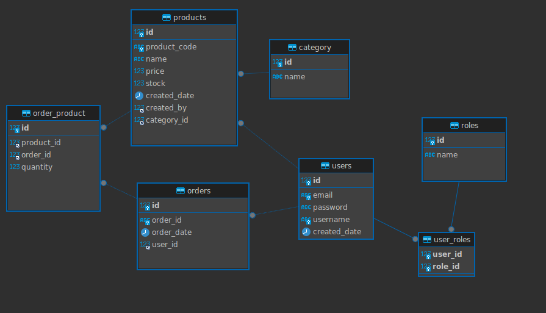

## Shop Warehouse

### Requirements

* A system user can be created and the user can  take USER, ADMIN, MOD roles.
* Role based access feature is available where ADMIN user oversees the entire application.
* An Admin user can create the category for the products.
* A user(MOD) can create the product. 
* A normal user can create an order where an order can consists of one or many products.
* APIs are protected(i.e Token mechanism is used to access the APIs)
* _Based on the technology limit above requirements can change._ 

### Entity Relationship Diagram.

### Architecture Diagram.

  TODO

######  Note:

_Spending time with this project, to polish up skills on graphQL, Java 17, Spring boot 3.2, SQL queries and backend coding._
